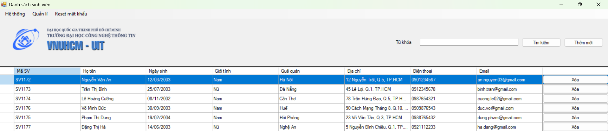

# Student Management System (SE104)

A desktop **student management system** built with **C# and Windows Forms**, backed by **Microsoft SQL Server**. It covers the academic workflow of a small university department — student and teacher records, course and class management, prerequisite rules, course registration, grading, and transcripts — under a **three-role access model** (Admin, Teacher, Student).

Business rules such as **prerequisite checks**, **schedule-conflict detection**, and **class-slot limits** are enforced at the database level through stored procedures and triggers.

> Coursework project (SE104, VNU-HCM University of Information Technology). Built to practice C#, WinForms, and SQL Server with stored procedures, triggers, and a simple data-access layer.

---

## Screenshots

**Login**


**Student list (Admin view)**



---

## Features

Each screen is available according to the role of the logged-in account.

### Admin
- Manage **students** (create, edit, list)
- Manage **teachers** (create, edit, list)
- Manage **courses** and **classes**
- Define **course prerequisites**
- **Reset a student's password** to the default

### Teacher
- View assigned **classes** and enrolled students
- **Enter and update grades**, and **export score sheets to Excel**
- Look up **exam score lists**

### Student
- **Register for courses** (validated against prerequisites, schedule conflicts, and remaining slots)
- View **registered courses**
- Look up **grades**
- View personal **profile**

### Shared
- Role-based **login**
- **Change password** (available to every account after first login)

---

## Tech Stack

| Layer | Technology |
|-------|-----------|
| Language | C# |
| UI | Windows Forms (WinForms) |
| Framework | .NET Framework 4.8 |
| Database | Microsoft SQL Server (Windows Authentication) |
| Data access | ADO.NET (`System.Data.SqlClient`) with **stored procedures** |
| Excel export | Microsoft Office Interop (Excel) |
| IDE | Visual Studio 2022 |

All database calls go through a single `Database.cs` wrapper exposing `SelectData`, `Select`, and `ExeCute`. Parameters are passed as a `List<CustomParameter>` and bound with `SqlCommand.Parameters.AddWithValue`, and most operations call **stored procedures** rather than inline SQL.

The database schema (`9.6_script.sql`) defines stored procedures plus triggers that enforce the core rules that reject registrations that clash on schedule, skip a required prerequisite, or exceed a class's slot count, and blocking deletion of an active class.

---

## Getting Started

### Prerequisites
- [Visual Studio 2022](https://visualstudio.microsoft.com/) with the **.NET desktop development** workload
- **Microsoft SQL Server** + SQL Server Management Studio (SSMS)
- Windows (WinForms desktop app)
- **Microsoft Excel** installed on the machine — required only for the grade-export feature (via Office Interop)

### 1. Clone the repository
```bash
git clone https://github.com/KanzNguyen/SE104-Student-Management-App.git
cd SE104-Student-Management-App
```

### 2. Create the database required before running
The application connects to a database named **`QLSV`**, which does not exist until you create it.

1. Open **`9.6_script.sql`** in SQL Server Management Studio.
2. Execute it. This creates the `QLSV` database, all tables, stored procedures, triggers, and seeds a default **admin** account (`123` / `123`).

> If the app starts with a "connected failed" message, this step was missed or the connection string (below) points to the wrong server.

### 3. Update the connection string
Open **`Database.cs`** and change the `Data Source` to your own SQL Server instance:

```csharp
private string connetionString =
    "Data Source=YOUR_SERVER_NAME;Initial Catalog=QLSV;Integrated Security=True";
```

Common values for `Data Source`: `.`, `localhost`, `(local)`, or `YOUR-PC\SQLEXPRESS`.

### 4. Build and run
1. Open **`ABD.sln`** in Visual Studio 2022.
2. Build the solution, then press **Start**.

### 5. First login
Log in with the seeded admin account:

| Field | Value |
|-------|-------|
| Role (Loại tài khoản) | Quản trị viên (Admin) |
| Username | `123` |
| Password | `123` |

From the admin account you can create teachers, courses, classes, and students through the UI. New teacher and student accounts are created with the default password **`123`**, which each user can change after logging in.

---

## Accounts & Passwords

- A fresh install seeds **only the admin account** (`123` / `123`). Teachers, students, courses, and classes are added by the admin through the UI.
- New teacher/student accounts default to password **`123`** (each can change it after first login).
- An admin can **reset a student's password**, which sets it back to `123`.

---

> The UI is in Vietnamese (e.g. *Sinh viên* = Student, *Giảng viên* = Teacher, *Môn học* = Course, *Đăng ký môn học* = Course registration, *Điều kiện* = Prerequisite).

---

## Notes & Limitations

- Academic project intended for practicing C# / WinForms / SQL Server — not production software.
- Seeded accounts share a default password (`123`), meant to be changed on first login.
- Uses Windows Authentication and a local SQL Server instance, so it runs on a single developer machine rather than a shared server.
- The grade-export feature uses Office Interop, so it requires Microsoft Excel to be installed on the machine running the app.
